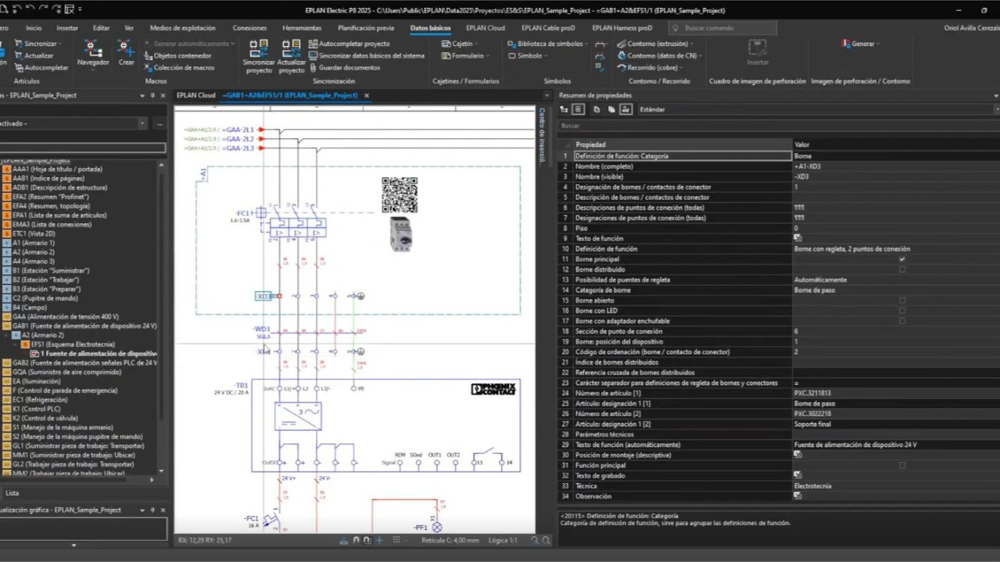

# Introducció al Disseny d'Esquemes Elèctrics amb ePLAN

*Curs 2025/2026 · David Mallén Julve*

---

## 1. Fonaments de l'enginyeria automatitzada

### 1.1. Què és l'enginyeria automatitzada?

L'ús de programari com EPLAN permet passar del simple dibuix a la **gestió de dades**.

Entre les seues principals capacitats trobem:

- Gestió integral de projectes electrotècnics.
- Generació automàtica de llistats de materials.
- Integració amb sistemes de fabricació de quadres.

### 1.2. L'entorn de treball

Abans de començar, cal configurar els recursos següents per a treballar correctament:

- La **biblioteca de símbols** basada en la normativa IEC.
- El **format de caixetí** normalitzat per al centre.
- La **graella de connexions** per a l'ús de l'*autoconnecting*.

### 1.3. Exemple de muntatge industrial

A continuació es mostra una imatge d'un quadre elèctric real per identificar els components que dibuixarem:

*Imatge sota llicència Creative Commons (CC)*

---

## 2. Treball amb EPLAN

### 2.1. Inserció de components pas a pas

Per a dibuixar el nostre esquema seguirem aquest ordre:

1. Seleccionar el símbol desitjat al menú lateral.
2. Col·locar l'element sobre la graella activa.
3. Assignar una referència única (per exemple, `-Q1`).

### 2.2. Vídeo de suport

Podeu veure el procés d'edició detallat en el següent recurs extern:

[Clica aquí per a veure el tutorial d'EPLAN a YouTube](https://www.youtube.com/watch?v=zbe4EWKrjB8)

> *Recordeu activar els subtítols per a una millor comprensió.*

### 2.3. Consell important

> **Important:** Mai oblideu omplir la **"Referència d'article"** a cada component; d'aquesta manera el llistat de la compra es generarà sense errors.
